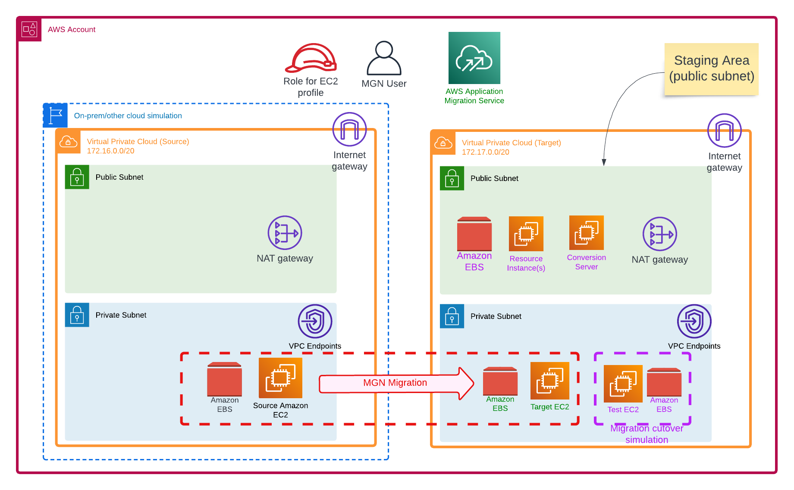

# Overview

Please see blog site https://devbuildit.com/2023/03/27/server-migrations-into-aws-mgn/ for detailed explaination of this repo contents.

This repo (and associated blog) will help you to setup a test environment on AWS so you can following the blog tutorial above.  Infrastructure deployment is:
  

## Requirements:
- AWS Account
- Terraform CLI installed with access to your target AWS account
- MGN service has been enabled on target account

## Deployment
- Clone repo into folder
- Run command 'Terraform init'
- Optional Checkov check via  "checkov -d . --download-external-modules True"
- Run command 'Terraform plan' 
- Run command 'Terraform apply' and type 'yes' to confirm deployment

## Tidy up
- Manual delete resources created manually or through MGN process
- Run command 'Terraform destroy'
 
